# ☁️ AWS DevOps Hands-On Practice

> Hands-on practice with core AWS services for DevOps workflows — EC2, S3, IAM, CloudWatch, and Lambda — all configured and tested as a fresher using a real AWS account.

---

## 📌 Services Covered

| Service | What I Did | Status |
|---------|-----------|--------|
| EC2 | Launched instance, SSH'd in, deployed Docker container | ✅ |
| S3 | Created bucket, uploaded JAR artifact via Console + CLI | ✅ |
| IAM | Created IAM user, set permissions, logged in via console | ✅ |
| CloudWatch | Created CPU utilization alarm | ✅ |
| Lambda | Deployed Python function, created and ran test event | ✅ |

---

## 📂 Repository Structure
```
AWS-DevOps-Practice/
├── ec2/
│   └── setup-commands.sh
├── s3/
│   └── commands.sh
├── iam/
│   └── notes.md
├── cloudwatch/
│   └── alarm-setup.md
├── lambda/
│   └── lambda_function.py
├── screenshots/
│   ├── ssh.png
│   ├── ssh1.png
│   ├── Ec2_AWS_console.png
│   ├── Ec2_browser_output.png
│   ├── S3_upload.png
│   ├── S3_uploaded.png
│   ├── s3_aws_cli.png
│   ├── IAM_user_login.png
│   ├── IAM_user.png
│   ├── IAM_user_dashboard.png
│   ├── cloudwatch_alert.png
│   ├── lambda.png
│   └── lambda1.png
└── README.md
```

---

## 🖥️ EC2 — Cloud Deployment

### What I Did
- Launched a `t3.micro` Ubuntu instance in `eu-north-1` (Stockholm)
- Connected via SSH using `.pem` key pair
- Installed Docker on the EC2 instance
- Pulled Docker image from Docker Hub
- Deployed Spring Boot app container on port `8080`
- Verified app running live at `http://13.48.46.57:8080`

### Commands Used
```bash
# Set key permissions
chmod 400 "devops-key.pem"

# SSH into EC2
ssh -i "devops-key.pem" ec2-user@ec2-13-48-46-57.eu-north-1.compute.amazonaws.com

# On EC2 — install Docker
sudo yum update -y
sudo yum install docker -y
sudo systemctl start docker
sudo usermod -aG docker ec2-user

# Pull and run container
docker pull harshad8782/devops-demo:latest
docker run -d \
  --name devops-app \
  -p 8080:8080 \
  --restart unless-stopped \
  harshad8782/devops-demo:latest

# Verify
docker ps
```

### Screenshots

📸 **SSH into EC2 — Docker Installation:**

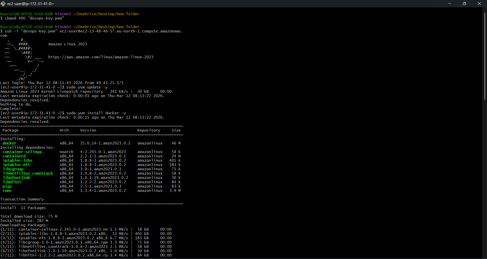

---

📸 **EC2 — Docker Pull & Container Running:**

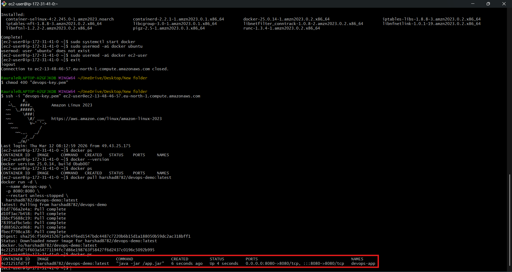

---

📸 **EC2 Instance Running in AWS Console:**

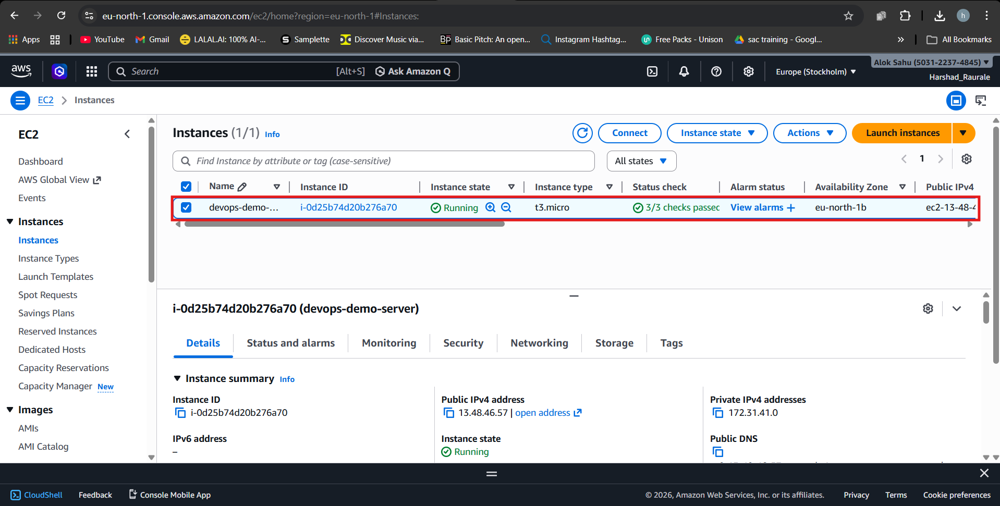

> Instance: `devops-demo-server` | Type: `t3.micro` | State: `Running` | Region: `eu-north-1`

---

📸 **Application Live on EC2:**

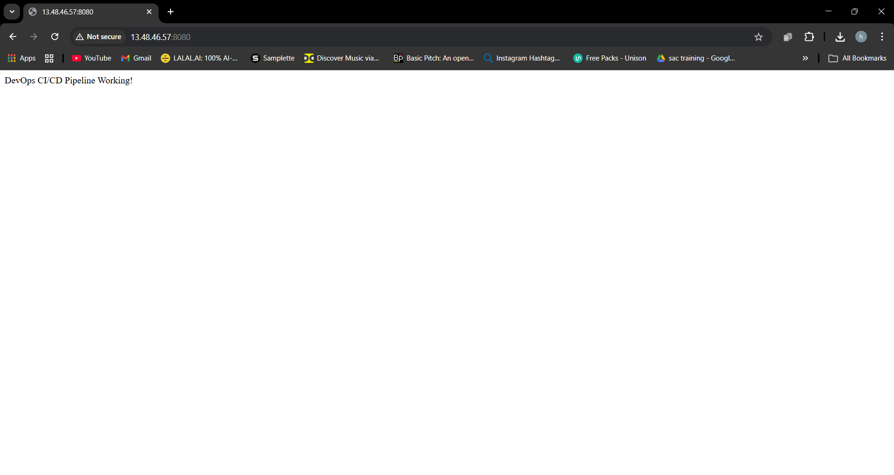

> ✅ **"DevOps CI/CD Pipeline Working!"** at `http://13.48.46.57:8080`

---

## 🪣 S3 — Artifact Storage

### What I Did
- Created S3 bucket `devops-demo-harshad` in `eu-north-1`
- Uploaded `devopsdemo-0.0.1-SNAPSHOT.jar` (20.1 MB) via AWS Console
- Verified upload via AWS CloudShell CLI

### Commands Used
```bash
# Create bucket
aws s3 mb s3://devops-demo-harshad --region eu-north-1

# Upload JAR artifact
aws s3 cp devopsdemo-0.0.1-SNAPSHOT.jar s3://devops-demo-harshad/

# Verify upload
aws s3 ls s3://devops-demo-harshad/
```

### Screenshots

📸 **S3 — Uploading JAR via Console:**

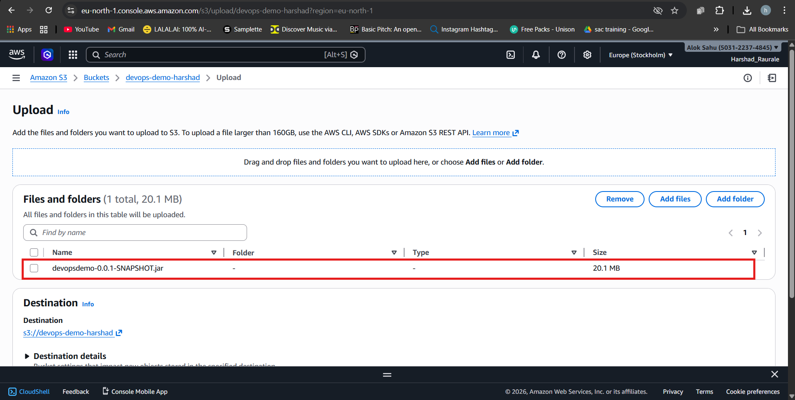

---

📸 **S3 — Upload Succeeded (20.1 MB):**

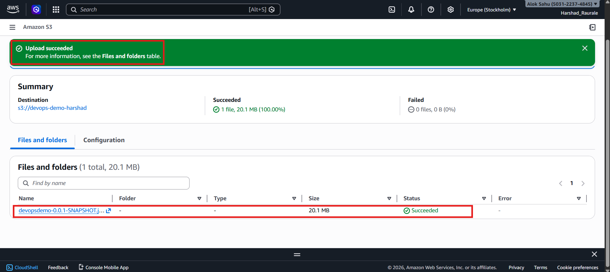

---

📸 **S3 — Verified via AWS CLI:**

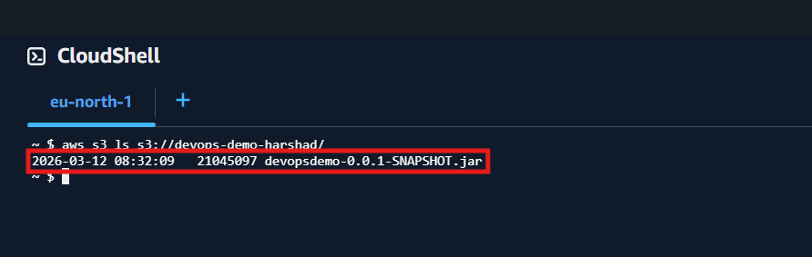

> `devopsdemo-0.0.1-SNAPSHOT.jar` — 21,045,097 bytes — uploaded ✅

---

## 👤 IAM — Identity & Access Management

### What I Did
- Logged into AWS as an IAM user (`harshad`)
- Created a new IAM user with console access
- Attached least-privilege policies
- Downloaded credentials and verified console login
- Understood IAM user vs root account separation

### Key Concepts Practiced
```
IAM User    → Individual identity with specific permissions
IAM Policy  → JSON document defining Allow/Deny rules
Least Privilege → Only grant minimum permissions needed
Access Keys → For programmatic CLI access
```

### Screenshots

📸 **IAM User Sign In:**

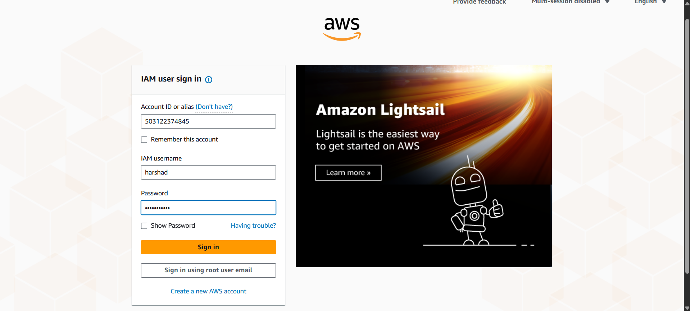

---

📸 **IAM User Created Successfully:**

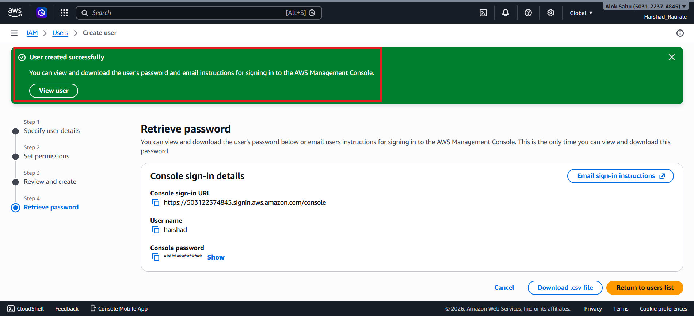

> User `harshad` created with console sign-in URL ✅

---

📸 **IAM User Dashboard — Logged In:**

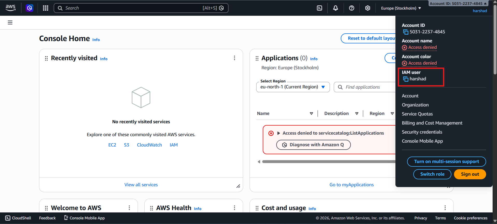

> Logged in as IAM user `harshad` — not root account ✅

---

## 📊 CloudWatch — Monitoring & Alerts

### What I Did
- Created a CloudWatch alarm named `CPU Usage Limit`
- Monitored EC2 `CPUUtilization` metric
- Configured alarm threshold and actions
- SNS notification pending confirmation (subscription limitation)

### Commands Used
```bash
# Create CPU alarm via CLI
aws cloudwatch put-metric-alarm \
  --alarm-name "CPU Usage Limit" \
  --metric-name CPUUtilization \
  --namespace AWS/EC2 \
  --statistic Average \
  --period 300 \
  --threshold 80 \
  --comparison-operator GreaterThanThreshold \
  --evaluation-periods 2 \
  --alarm-description "Alert when CPU exceeds 80%"

# List alarms
aws cloudwatch describe-alarms
```

### Screenshot

📸 **CloudWatch Alarm Created:**

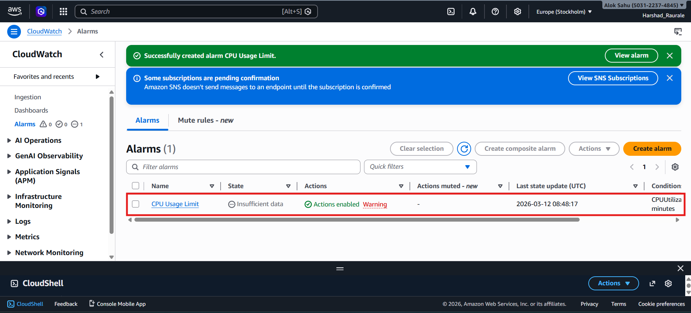

> Alarm `CPU Usage Limit` created ✅ | Actions enabled | SNS subscription pending confirmation

---

## ⚡ Lambda — Serverless Function

### What I Did
- Created a Python 3.11 Lambda function named `devops-hello`
- Wrote a function that returns a JSON response
- Created and saved a custom test event named `Myevent`
- Successfully executed the function — Status: Succeeded
- Execution duration: 1.57ms | Billed: 2ms | Memory: 39MB

### Function Code
```python
import json

def lambda_handler(event, context):
    name = event.get('name', 'DevOps World')
    return {
        'statusCode': 200,
        'body': json.dumps({
            'message': f'Hello {name}!',
            'deployed_by': 'Harshad Raurale',
            'stack': 'Jenkins → Docker → EC2 → Lambda'
        })
    }
```

### Test Event
```json
{
  "name": "DevOps World"
}
```

### Response
```json
{
  "statusCode": 200,
  "body": {
    "message": "Hello DevOps World!",
    "deployed_by": "Harshad Raurale",
    "stack": "Jenkins → Docker → EC2 → Lambda"
  }
}
```

### Screenshots

📸 **Lambda Function Overview:**

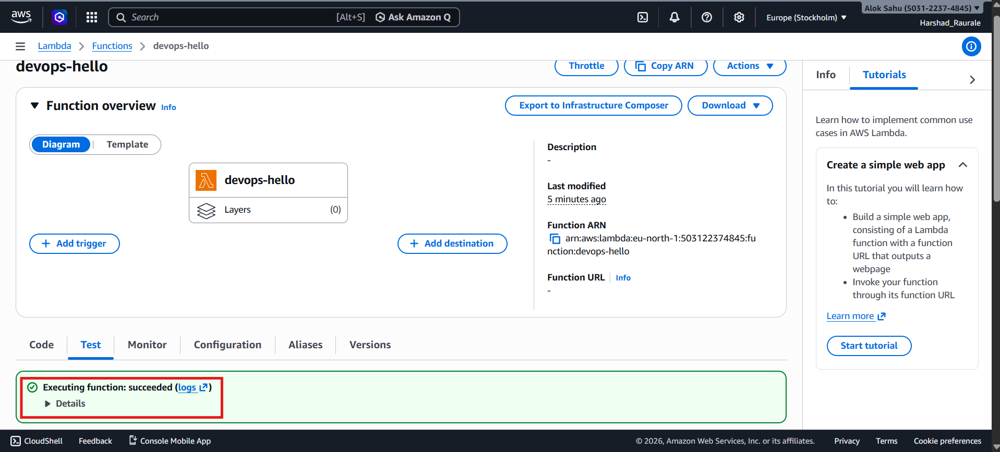

> Function `devops-hello` deployed ✅ | Executing function: succeeded

---

📸 **Lambda Test Event — Execution Result:**

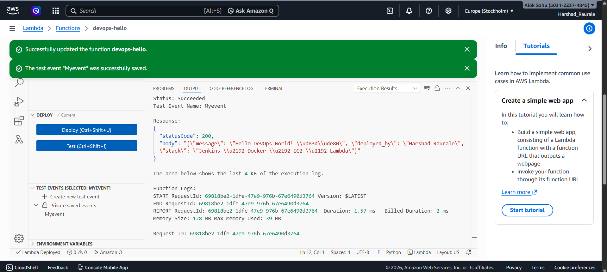

> Test Event: `Myevent` | Status: Succeeded | Duration: 1.57ms ✅

---

## 🔗 Related Repository

This AWS practice is part of a larger DevOps learning journey.

👉 **CI/CD Pipeline Repo:** [DevOps-CICD](https://github.com/harshad8782/DevOps-CICD)
```
DevOps-CICD repo covers:
→ GitHub Actions CI pipeline
→ Jenkins CD pipeline
→ Docker + Docker Hub
→ Spring Boot containerization
```

---

## 🗺️ Full DevOps Architecture
```
Developer
    │
    │ git push
    ▼
GitHub Actions (CI)
    │
    ├── Maven Build
    ├── Docker Build
    └── Push → Docker Hub
                    │
                    ▼
             Jenkins (CD)
                    │
                    └── Pull Image → Deploy Container
                                          │
                                          ▼
                                    AWS EC2 ☁️
                                    (Live App)
                                          │
                              ┌───────────┼───────────┐
                              ▼           ▼           ▼
                           AWS S3    CloudWatch    Lambda
                        (Artifacts) (Monitoring) (Serverless)
                              │
                           AWS IAM
                        (Access Control)
```

---

## 👨‍💻 Author

**Harshad Raurale**  
DevOps / Cloud Enthusiast

[](https://github.com/harshad8782)
[](https://linkedin.com)

---

> ⭐ If you found this helpful, please consider giving it a star!